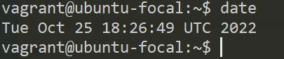
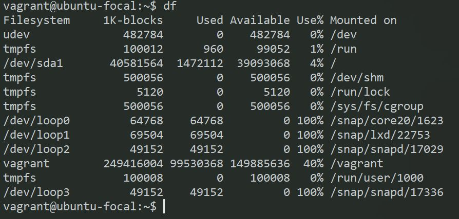
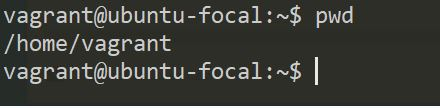
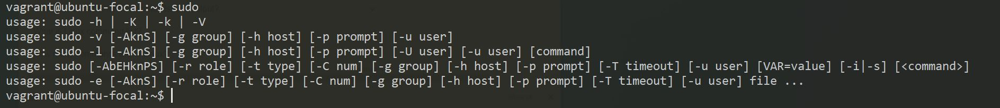
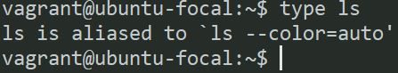
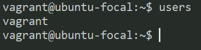
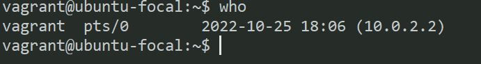

## **10 LINUX COMMAND**

# What is a Linux command?

Linux is a family of open-source Unix-like operating systems based on the Linux kernel. The Linux command is a utility of the Linux operating system. All basic and advanced tasks can be done by executing commands. The commands are executed on the Linux terminal. The terminal is a command-line interface to interact with the system, which is similar to the command prompt in the Windows OS. Commands in Linux are case-sensitive.

1.Cal command

The cal command displays a calendar of the specified year or month. The Year parameter names the year for which you want a calendar.

_syntax_

$ Cal

_output_

2. date command

date command is used to display the system date and time. date command is also used to set date and time of the system. By default the date command displays the date in the time zone on which unix/linux operating system is configured

_syntax_

$ date

_output_
  

3.df command

The df command displays the amount of disk space available on the filesystem with each file name's argument

_syntax_

$ df

_output_

4. free -h command

Linux provides a “free” built-in command utility. It is a useful command that provides detailed information about the total amount of used memory and free space, swap memory, and buffer used by the kernel.

_syntax_

5. ip addr command

 Running “ip address show” will display the address configuration for all interfaces on the Linux workstation

 _syntax_

 
 6. pwd command

 What is the PWD commands?
Description. The pwd command writes to standard output the full path name of your current directory (from the root directory). All directories are separated by a / (slash). The root directory is represented by the first /, and the last directory named is your current directory.

 _syntax_

 

 7. sudo command

 sudo allows a permitted user to execute a command as the superuser or another user, as specified by the security policy.

 _syntax_

 

 8. type command

 In the Windows Command shell, type is a built in command which displays the contents of a text file. Use the type command to view a text file without modifying it.

  _syntax_

  

 9. user command

 users command in Linux system is used to show the user names of users currently logged in to the current host. It will display who is currently logged in according to FILE

 _syntax_

 

 10. who command

 who command is a tool print information about users who are currently logged in. who command only see a real user who logged in. On most Linux distribution, who command is already installed. To use it, just type who on your console.

 _syntax_

 